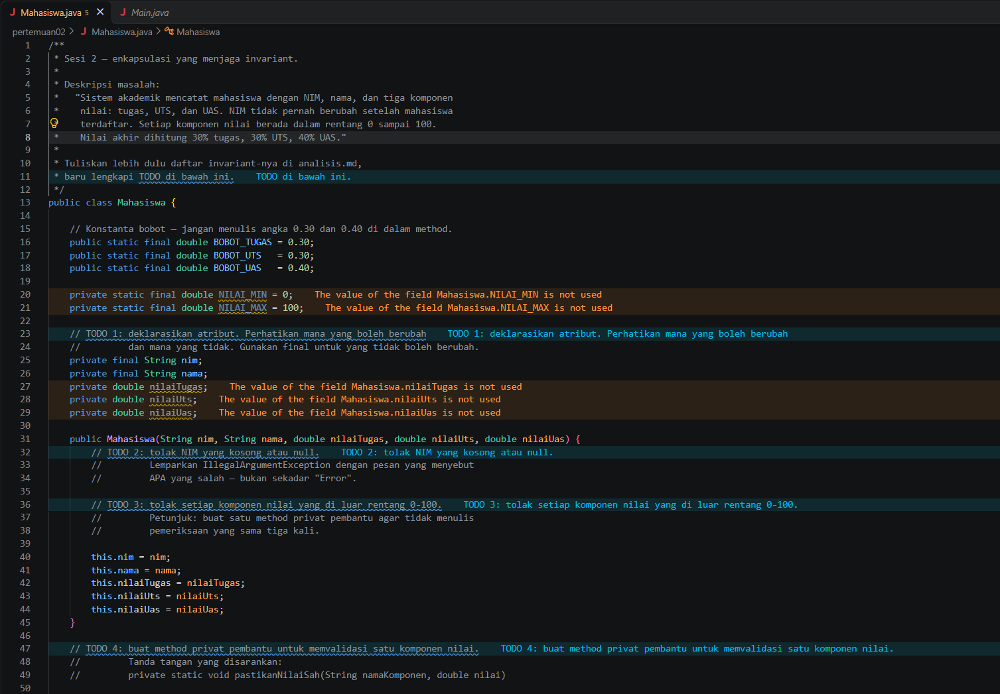
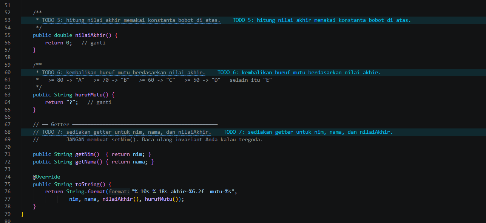
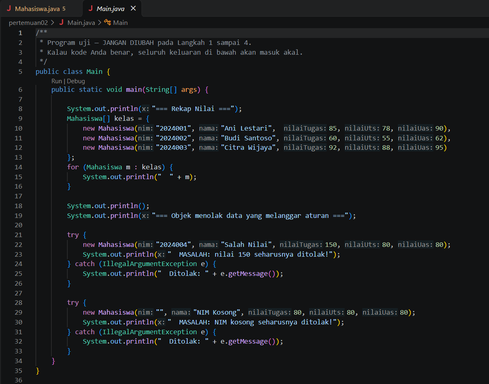
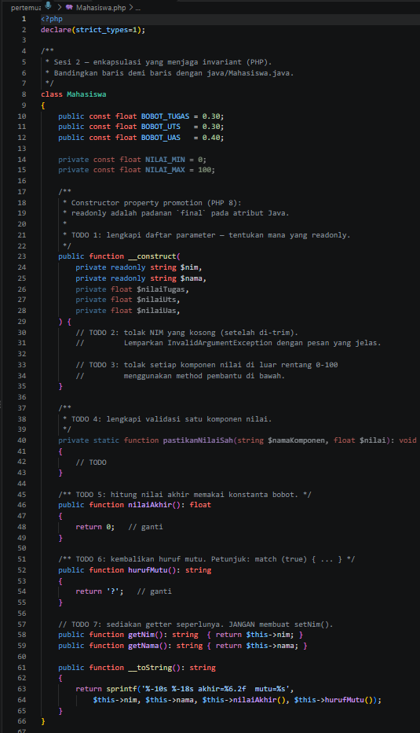
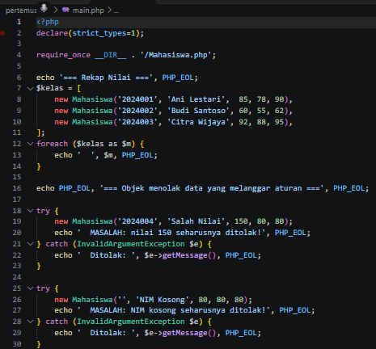
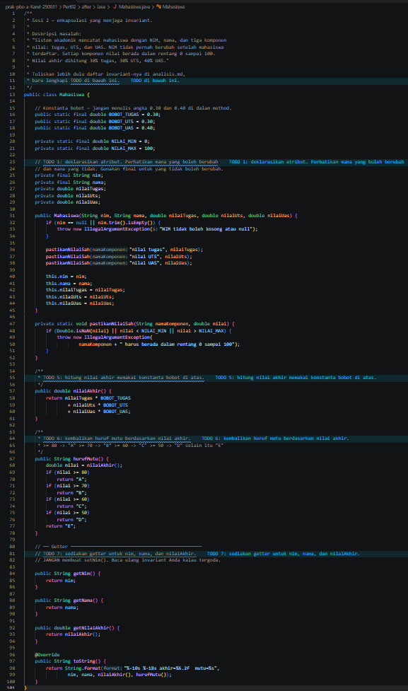
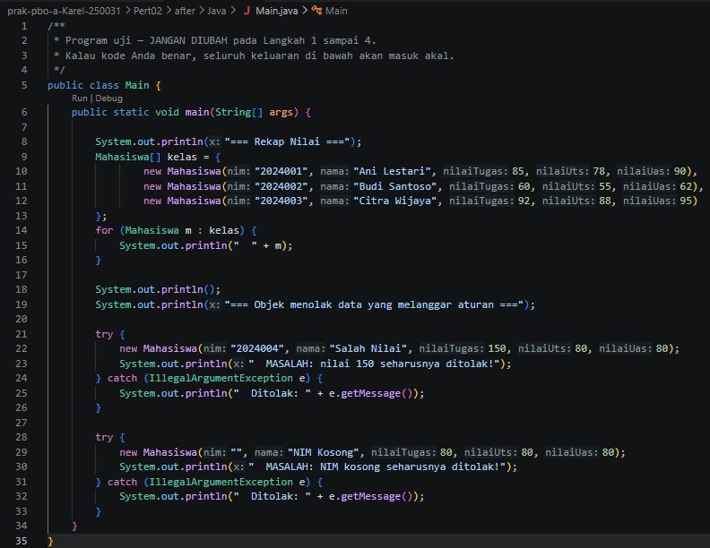
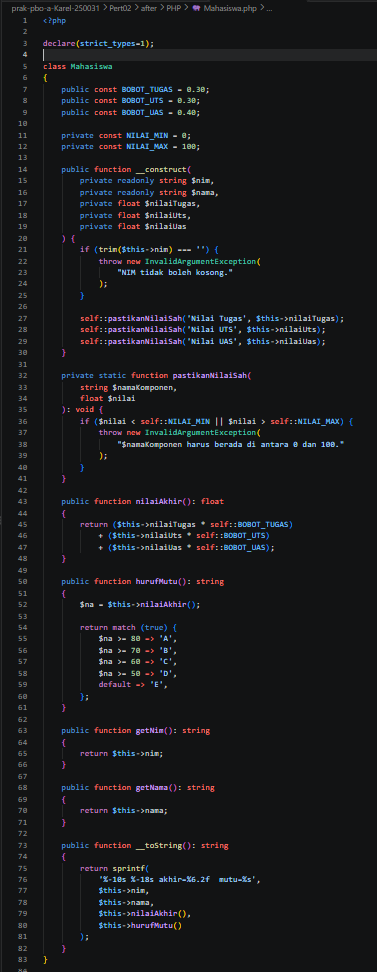
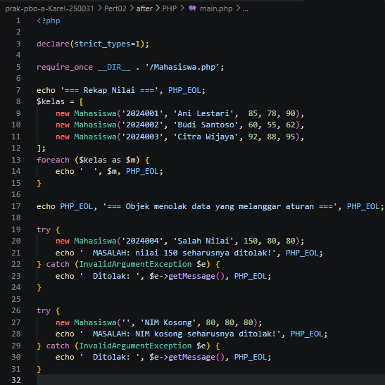

# Pertemuan 02 — Enkapsulasi dan Invariant

| | |
|---|---|
| **Nama** | Karel Abimanyu Ahpandi |
| **NIM** | 4525210031 |
| **Kelas** | A |
| **Mata kuliah** | Praktikum Pemrograman Berorientasi Objek (PBO) |
| **Bahasa** | Java dan PHP |

## Struktur folder

```
Pert02/
├── before/            # kode awal dari dosen (masih ada TODO)
│   ├── Java/          # Mahasiswa.java, Main.java
│   └── PHP/           # Mahasiswa.php, main.php
├── after/             # kode setelah TODO dilengkapi
│   ├── Java/          # Mahasiswa.java, Main.java
│   └── PHP/           # Mahasiswa.php, main.php
├── img/
│   ├── before/        # screenshot kode sebelum
│   └── after/         # screenshot kode sesudah
└── README.md
```

## Yang dikerjakan (before → after)

### Java — `Mahasiswa.java`

| Bagian | Before | After |
|---|---|---|
| Constructor | Hanya mengisi atribut, tanpa validasi | Menolak NIM `null`/kosong (setelah `trim()`) dan memanggil `pastikanNilaiSah()` untuk tiap nilai |
| `pastikanNilaiSah()` | Belum ada | Method privat pembantu. Menolak nilai di luar 0–100 (dan `NaN`) dengan `IllegalArgumentException` yang pesannya menyebut komponen yang salah |
| `nilaiAkhir()` | `return 0` | Menghitung dengan konstanta `BOBOT_TUGAS`, `BOBOT_UTS`, `BOBOT_UAS` |
| `hurufMutu()` | `return "?"` | `if` bertingkat sesuai batas A–E |
| Getter | Hanya `getNim()` dan `getNama()` | Ditambah `getNilaiAkhir()`. `setNim()` sengaja tidak dibuat |

`Main.java` tidak diubah (isinya sama dengan versi awal).

### PHP — `Mahasiswa.php`

| Bagian | Before | After |
|---|---|---|
| Constructor | Parameter dengan `readonly` sudah disediakan (constructor property promotion), tetapi validasinya masih TODO | NIM kosong (setelah `trim()`) ditolak dengan `InvalidArgumentException`, dan tiap nilai dicek lewat `pastikanNilaiSah()` |
| `pastikanNilaiSah()` | Badan method kosong | Menolak nilai di luar 0–100 |
| `nilaiAkhir()` | `return 0` | Menghitung dengan konstanta bobot |
| `hurufMutu()` | `return '?'` | `match (true)` sesuai batas A–E |

`main.php` tidak diubah.

## Screenshot

### Before

**`Mahasiswa.java` (bagian 1)**



**`Mahasiswa.java` (bagian 2)**



**`Main.java`**



**`Mahasiswa.php`**



**`main.php`**



### After

**`Mahasiswa.java`**



**`Main.java`**



**`Mahasiswa.php`**



**`main.php`**



## Kesimpulan

Dengan atribut `private`, `final`/`readonly`, dan validasi di constructor, objek `Mahasiswa` tidak mungkin berada dalam keadaan yang melanggar aturan. Karena pengecekan nilai dipusatkan di satu method pembantu, aturan 0–100 cukup ditulis sekali dan tidak perlu diulang di tiap tempat.
