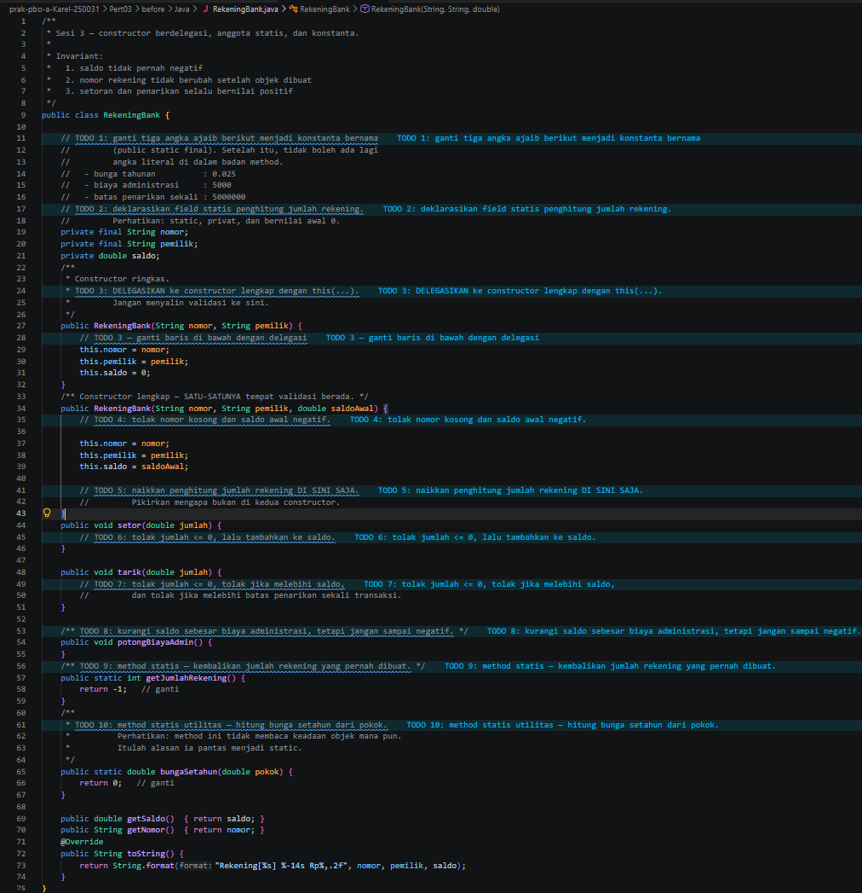
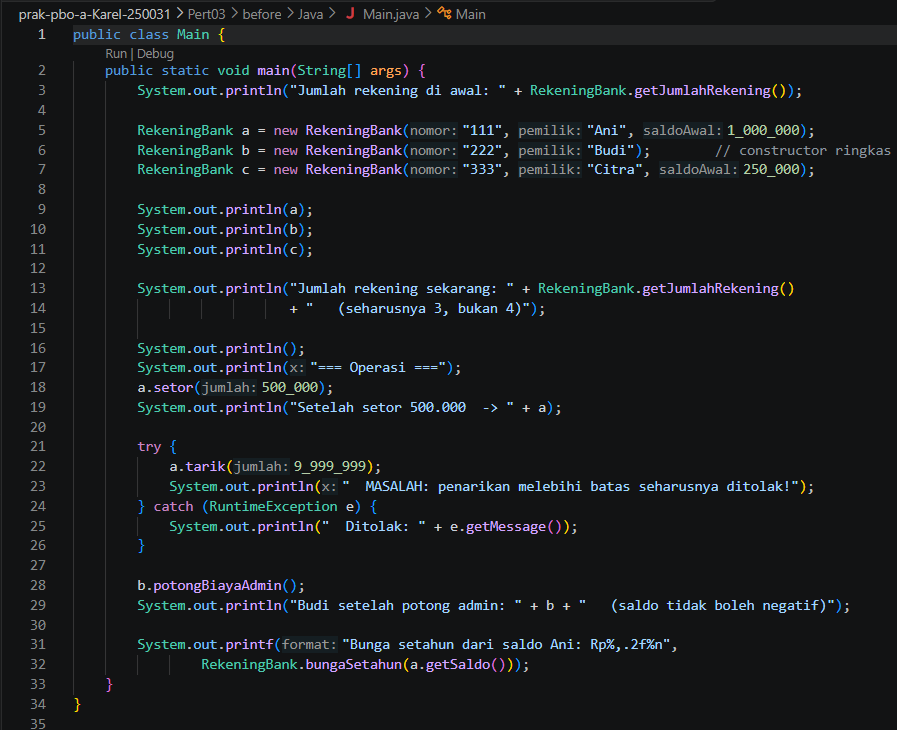
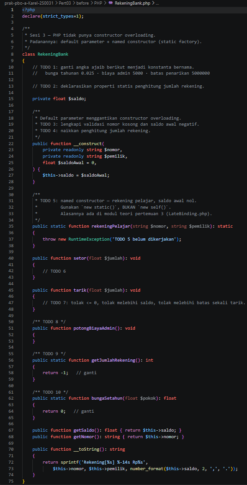
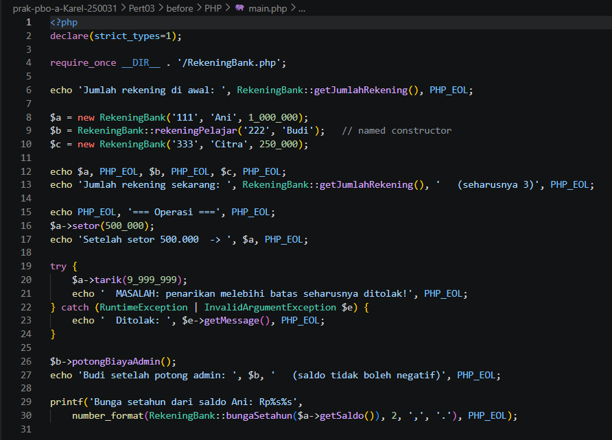
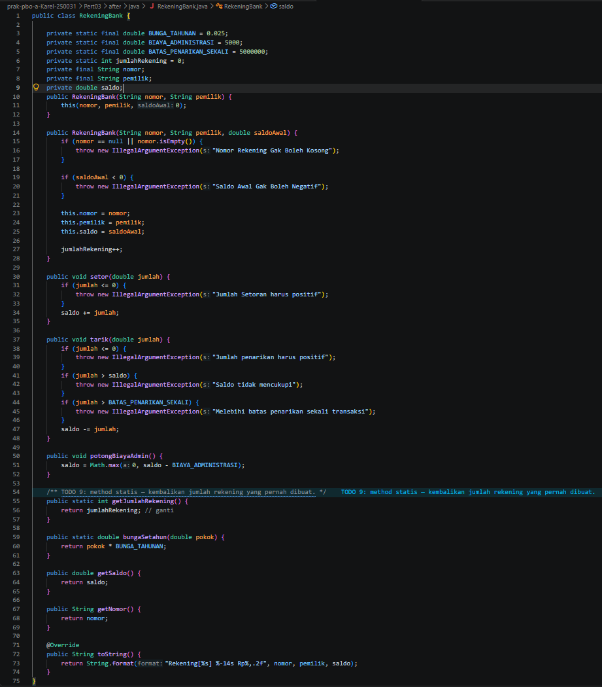
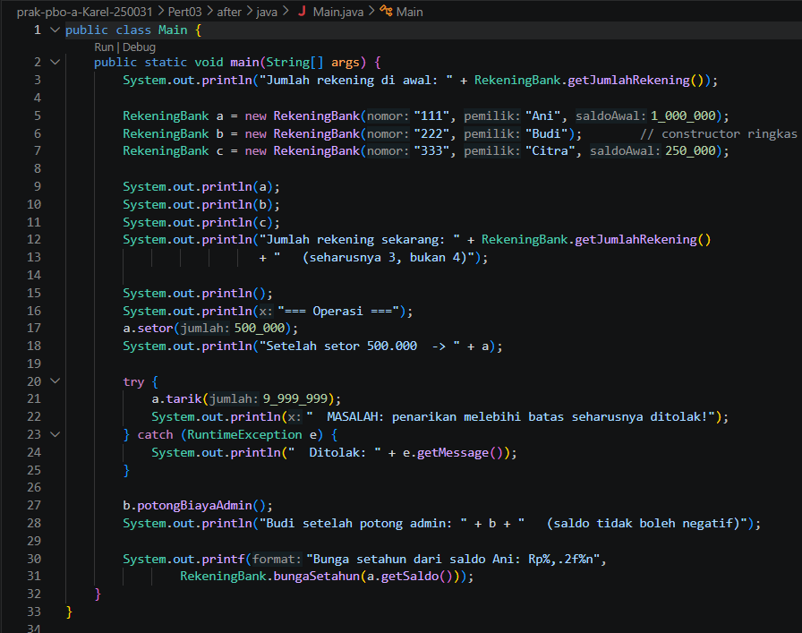
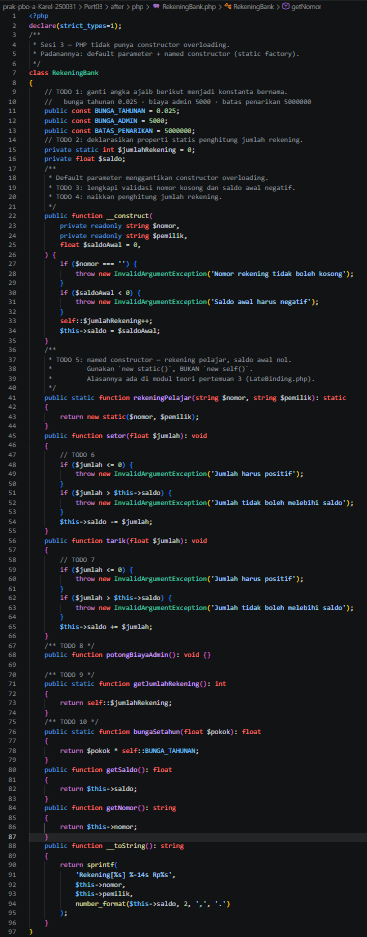
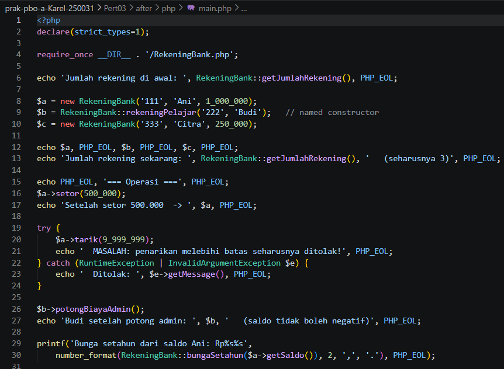

# Pertemuan 03 — Constructor Berdelegasi, Anggota Statis, dan Konstanta

| | |
|---|---|
| **Nama** | Karel Abimanyu Ahpandi |
| **NIM** | 4525210031 |
| **Kelas** | A |
| **Mata kuliah** | Praktikum Pemrograman Berorientasi Objek (PBO) |
| **Bahasa** | Java dan PHP |


## Struktur folder

```
Pert03/
├── before/            # kode awal dari dosen (masih ada TODO)
│   ├── Java/          # RekeningBank.java, Main.java
│   └── PHP/           # RekeningBank.php, main.php
├── after/             # kode setelah TODO dilengkapi
│   ├── java/          # RekeningBank.java, Main.java
│   └── php/           # RekeningBank.php, main.php
├── img/
│   ├── before/        # screenshot kode sebelum
│   └── after/         # screenshot kode sesudah
└── README.md
```

## Yang dikerjakan (before → after)

### Java — `RekeningBank.java`

| Bagian | Before | After |
|---|---|---|
| Konstanta | Masih angka ajaib (TODO 1) | `BUNGA_TAHUNAN` (0.025), `BIAYA_ADMINISTRASI` (5000), `BATAS_PENARIKAN_SEKALI` (5000000) |
| Penghitung | Belum ada | `private static int jumlahRekening = 0` |
| Constructor ringkas | Menyalin isi sendiri (saldo = 0) | Didelegasikan: `this(nomor, pemilik, 0)` |
| Constructor lengkap | Belum ada validasi | Menolak nomor kosong dan saldo awal negatif, lalu menaikkan `jumlahRekening` di sini saja |
| `setor()` | Kosong | Menolak jumlah <= 0, lalu menambah saldo |
| `tarik()` | Kosong | Menolak jumlah <= 0, jumlah melebihi saldo, dan jumlah melebihi batas sekali tarik |
| `potongBiayaAdmin()` | Kosong | `saldo = Math.max(0, saldo - BIAYA_ADMINISTRASI)` |
| `getJumlahRekening()` | `return -1` | `return jumlahRekening` |
| `bungaSetahun()` | `return 0` | `pokok * BUNGA_TAHUNAN` |

`Main.java` tidak diubah.

### PHP — `RekeningBank.php`

| Bagian | Before | After |
|---|---|---|
| Konstanta | Belum ada | `BUNGA_TAHUNAN`, `BUNGA_ADMIN`, `BATAS_PENARIKAN` |
| Penghitung | Belum ada | `private static int $jumlahRekening = 0` |
| Constructor | Hanya mengisi saldo | Menolak nomor kosong dan saldo awal negatif, lalu menaikkan penghitung |
| `rekeningPelajar()` | Melempar `RuntimeException` (belum dikerjakan) | `return new static($nomor, $pemilik)` |
| `getJumlahRekening()` | `return -1` | `return self::$jumlahRekening` |
| `bungaSetahun()` | `return 0` | `$pokok * self::BUNGA_TAHUNAN` |
| `setor()`, `tarik()`, `potongBiayaAdmin()` | Kosong | Sudah terisi, tetapi logikanya belum sesuai versi Java (lihat bagian **Catatan**) |

`main.php` tidak diubah.


## Screenshot

### Before

**`RekeningBank.java`**



**`Main.java`**



**`RekeningBank.php`**



**`main.php`**



### After

**`RekeningBank.java`**



**`Main.java`**



**`RekeningBank.php`**



**`main.php`**




## Kesimpulan

Constructor berdelegasi membuat validasi cukup ditulis di satu tempat, dan penghitung statis hanya benar kalau dinaikkan di constructor lengkap saja. Konstanta bernama menggantikan angka ajaib sehingga nilai bunga, biaya, dan batas bisa diubah di satu baris. Di PHP, padanan constructor overloading adalah default parameter dan named constructor dengan `new static`.
