# Pertemuan 04 — Pewarisan (Inheritance)

| | |
|---|---|
| **Nama** | Karel Abimanyu Ahpandi |
| **NIM** | 4525210031 |
| **Kelas** | A |
| **Mata kuliah** | Praktikum Pemrograman Berorientasi Objek (PBO) |
| **Bahasa** | Java dan PHP |

## Struktur folder

```
Pert04/
├── before/            # kode awal dari dosen (masih ada TODO)
│   ├── java/          # Pegawai, PegawaiTetap, PegawaiKontrak, Main
│   └── php/           # Pegawai.php (semua kelas), main.php
├── after/             # kode setelah dikerjakan
│   ├── java/          # Pegawai, PegawaiTetap, PegawaiKontrak, Main
│   └── php/           # Pegawai.php (semua kelas), main.php
├── img/
│   ├── before/        # screenshot kode sebelum
│   └── after/         # screenshot kode sesudah
└── README.md
```

Di PHP, seluruh hierarki ditaruh dalam satu berkas (`Pegawai.php`) supaya mudah dibandingkan dengan versi Java.

## Yang dikerjakan (before → after)

### PHP — `Pegawai.php` dan `main.php`

| Bagian | Before | After |
|---|---|---|
| `Pegawai` constructor | Validasi gaji belum ada | Menolak gaji pokok negatif dengan `InvalidArgumentException` |
| `Pegawai::hitungGaji()` | `return 0` | `return $this->gajiPokok` |
| `PegawaiTetap::hitungGaji()` | `return 0` | Gaji dasar dari `parent::hitungGaji()` dikali `(1 + tunjangan)`, tunjangan dibatasi `min(..., 0.40)` |
| `PegawaiKontrak` | Sudah ada | Tidak meng-override `hitungGaji()`, karena aturan gaji dasar dari induk sudah cukup |
| `Dosen` | Belum ada | Turunan `PegawaiTetap`, menambah tunjangan fungsional 10% di atas hasil `parent::hitungGaji()` |
| `PegawaiHarian` | Belum ada | Turunan `Pegawai`, gaji = gaji per hari x hari kerja |
| `main.php` | Hanya 2 pegawai | Ditambah `Dosen` dan `PegawaiHarian` ke daftar |

### Java — `Pegawai`, `PegawaiTetap`, `PegawaiKontrak`, `Main`

Isi folder `after/java` **sama dengan `before/java`**, yaitu masih berupa kerangka dari dosen. `Pegawai.hitungGaji()` dan `PegawaiTetap.hitungGaji()` masih `return 0` dan komentar TODO belum dihapus. Detailnya ada di bagian **Catatan**.

## Screenshot

### Before

**`Pegawai.java`**

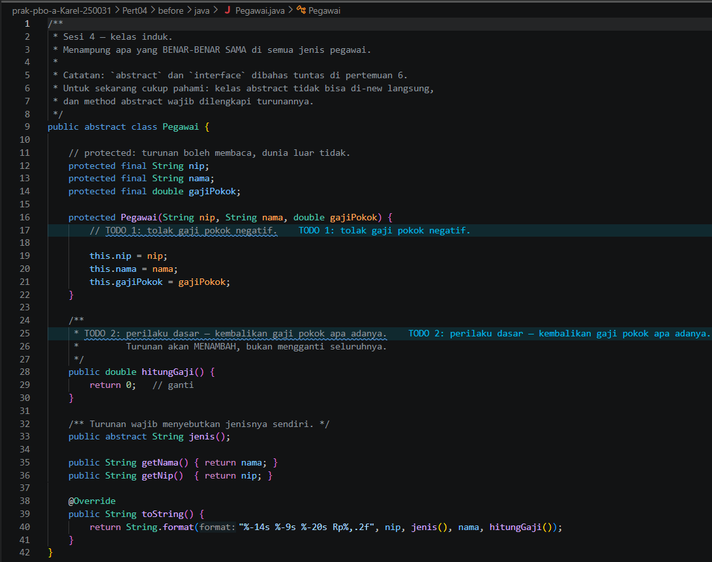

**`PegawaiTetap.java`**

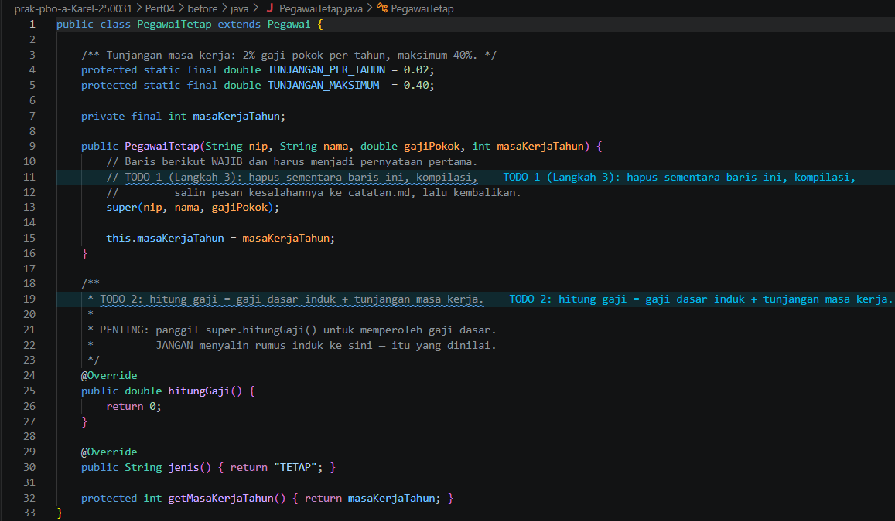

**`PegawaiKontrak.java`**

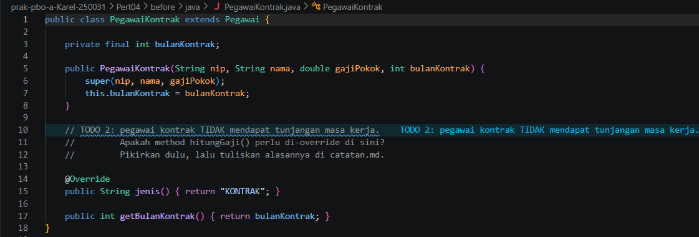

**`Main.java`**

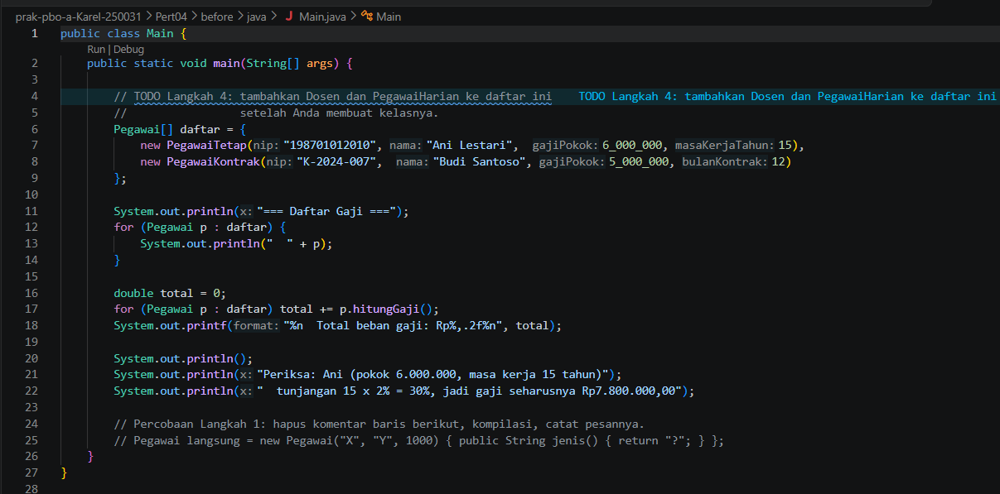

**`Pegawai.php`**

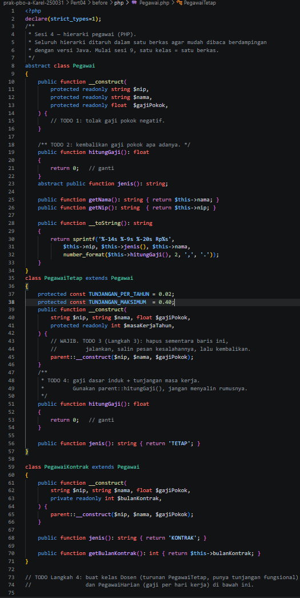

**`main.php`**

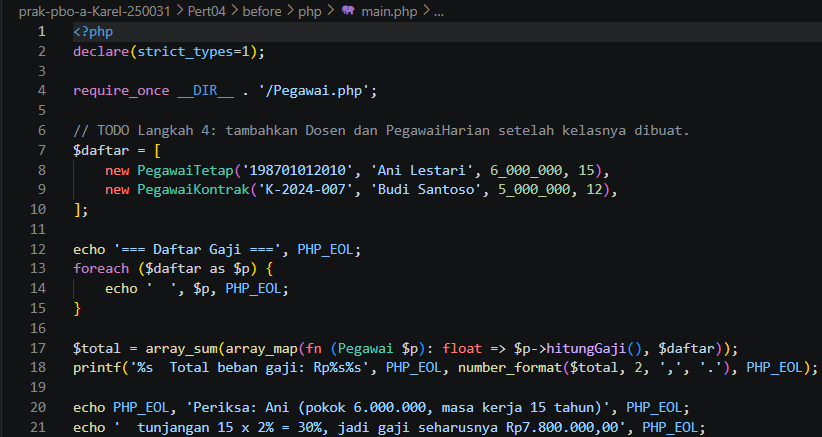

### After

**`Pegawai.java`**

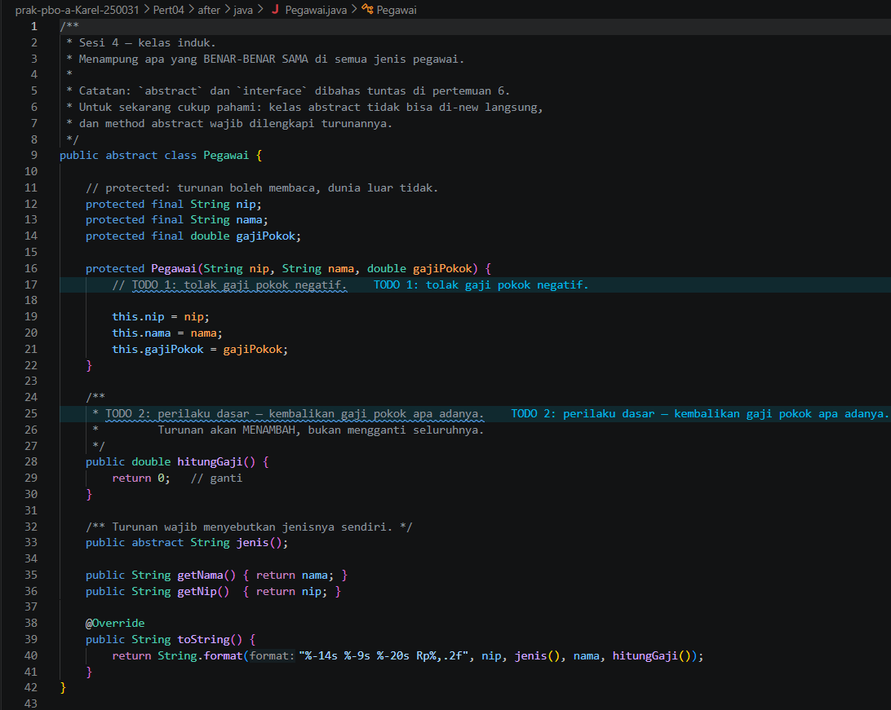

**`PegawaiTetap.java`**

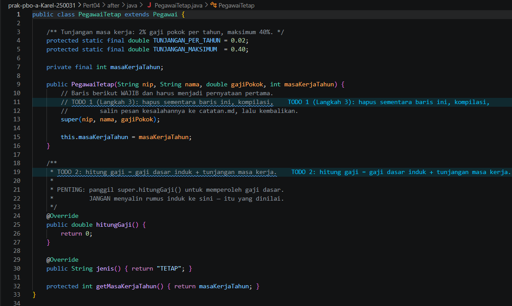

**`PegawaiKontrak.java`**

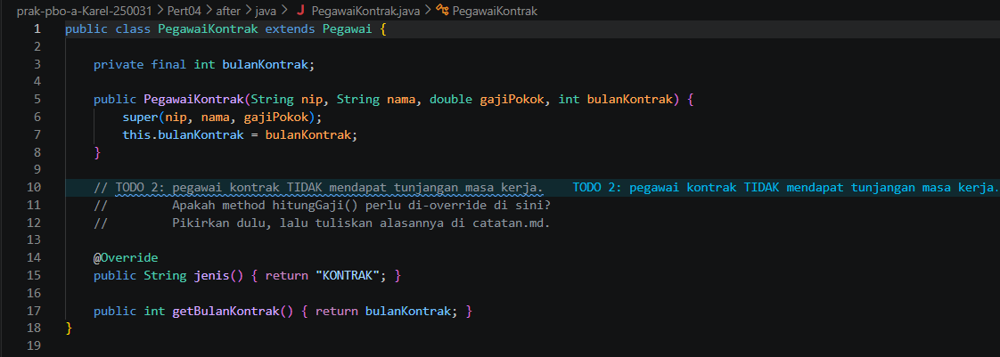

**`Main.java`**

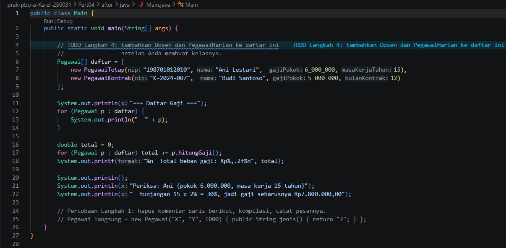

**`Pegawai.php` (bagian 1)**

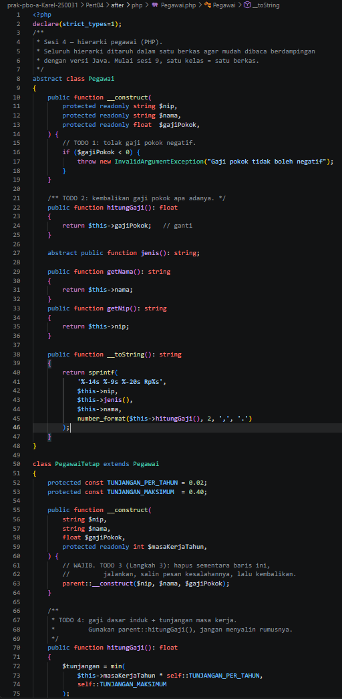

**`Pegawai.php` (bagian 2)**

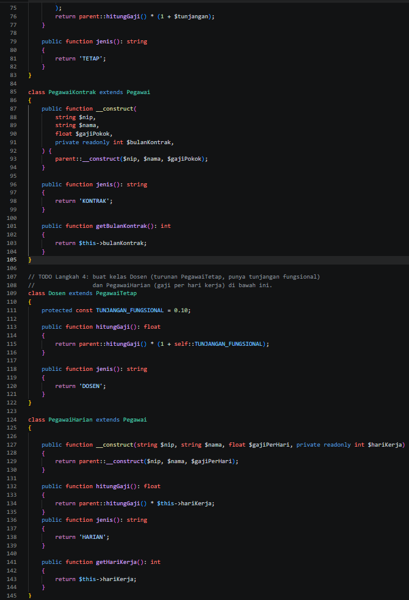

**`main.php`**

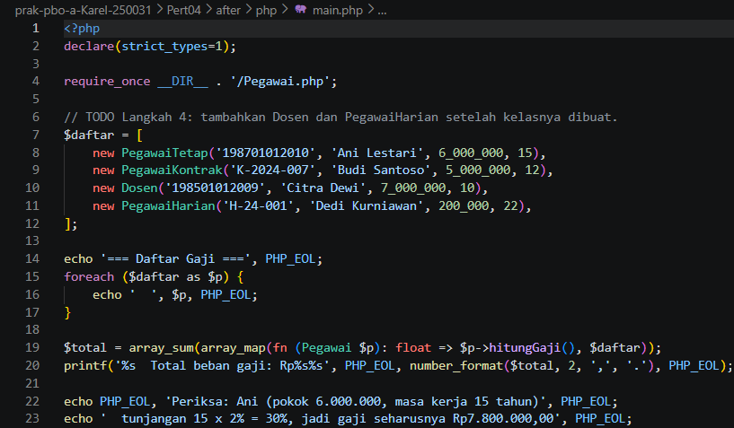


## Kesimpulan

Dengan pewarisan, bagian yang sama (nip, nama, gaji pokok, cara mencetak) cukup ditulis sekali di `Pegawai`, dan tiap jenis pegawai hanya menulis bagian yang berbeda. Memanggil `parent::hitungGaji()` membuat perubahan rumus di induk otomatis ikut ke semua turunan, sedangkan menyalin rumus ke turunan membuat kodenya mudah tidak sinkron. Bagian Java masih perlu dilengkapi dengan pola yang sama seperti versi PHP.
