# Pertemuan 05 — Polimorfisme

| | |
|---|---|
| **Nama** | Karel Abimanyu Ahpandi |
| **NIM** | 4525210031 |
| **Kelas** | A |
| **Mata kuliah** | Praktikum Pemrograman Berorientasi Objek (PBO) |
| **Bahasa** | Java dan PHP |

## Tentang pertemuan ini

Materi pertemuan ini adalah **polimorfisme**: satu pemanggilan method bisa menghasilkan perilaku berbeda tergantung objek aslinya. Konsep yang dipakai:

- **Kelas induk sebagai kontrak.** `BangunDatar` menetapkan method `luas()` dan `keliling()` yang wajib diisi turunannya.
- **Upcasting.** Variabel bertipe induk (`BangunDatar`) boleh menyimpan objek turunan (`Lingkaran`, `Persegi`, dst). Perulangan cukup memanggil `b.luas()` tanpa peduli bentuknya.
- **Downcasting** (`instanceof`) hanya dipakai kalau benar-benar perlu, misalnya untuk mengambil jari-jari yang hanya dimiliki `Lingkaran`.
- **Anti-pattern.** Kode yang memakai rantai `if / else if` untuk menghitung luas per tipe harus disunting setiap ada bangun baru. Versi polimorfik cukup menambah satu kelas.

## Studi kasus

Hierarki bangun datar:

```
BangunDatar (abstract)
├── Lingkaran
├── Persegi
├── Segitiga
└── Trapesium
```

Latihan tambahan di PHP: hierarki **Notifikasi** (`Email`, `SMS`, `WhatsApp`) dengan fungsi `kirimSemua()` yang tidak boleh memakai `instanceof` atau `switch` atas jenis notifikasi.

## Struktur folder

```
Pert05/
├── before/            # kode awal dari dosen (masih ada TODO)
│   ├── Java/          # BangunDatar, Lingkaran, Persegi, AntiPattern, Main
│   └── PHP/           # BangunDatar.php, main.php, notifikasi.php
├── after/             # kode setelah dikerjakan
│   ├── java/          # + Segitiga, Trapesium, AntiPatternRefaktor
│   └── php/           # BangunDatar.php, main.php, notifikasi.php
├── img/
│   ├── before/        # screenshot kode sebelum
│   └── after/         # screenshot kode sesudah
└── README.md
```

## Yang dikerjakan (before → after)

### Java

| Berkas | Before | After |
|---|---|---|
| `Lingkaran.java` | `luas()` dan `keliling()` masih `return 0`, belum ada validasi | Menolak jari-jari <= 0. Luas `Math.PI * r * r`, keliling `2 * Math.PI * r` |
| `Persegi.java` | `luas()` dan `keliling()` masih `return 0` | Menolak sisi <= 0. Luas `sisi * sisi`, keliling `4 * sisi` |
| `Segitiga.java` | Belum ada | Baru. Menerima alas, tinggi, dan sisi miring. Luas `0.5 * alas * tinggi`, keliling = jumlah tiga sisi |
| `Trapesium.java` | Belum ada | Baru. Menerima sisi atas, sisi bawah, tinggi, sisi kiri, sisi kanan. Luas `0.5 * (atas + bawah) * tinggi` |
| `Main.java` | Array berisi `Lingkaran` dan `Persegi` | Ditambah `Segitiga` dan `Trapesium`. Logika perulangan tidak disentuh |
| `AntiPattern.java` | Versi tanpa polimorfisme (bahan Langkah 5) | Tidak diubah, dipertahankan sebagai pembanding |
| `AntiPatternRefaktor.java` | Belum ada | Baru. Versi polimorfik dengan `interface Bangun` dan `record` |
| `BangunDatar.java` | Kelas induk abstrak | Tidak diubah |

### PHP

| Berkas | Before | After |
|---|---|---|
| `BangunDatar.php` | `Lingkaran` dan `Persegi` dengan TODO | `Lingkaran`, `Persegi` dilengkapi (validasi, `M_PI`). Ditambah `Segitiga` (rumus Heron + pengecekan syarat segitiga) dan `Trapesium` |
| `main.php` | Array berisi `Lingkaran` dan `Persegi` | Ditambah `Segitiga` dan `Trapesium` |
| `notifikasi.php` | Kerangka dengan TODO | Kelas abstrak `Notifikasi` (`kirim()`, `saluran()`), tiga turunan `Email`, `SMS`, `WhatsApp`, dan `kirimSemua()` yang cukup memanggil `$notifikasi->kirim($pesan)` |

## Cuplikan kode penting

**Java: perulangan yang sama, perilaku berbeda tiap objek (`Main.java`)**

```java
BangunDatar[] daftar = {
    new Lingkaran(7),
    new Persegi(5),
    new Segitiga(3.0, 4, 5),
    new Trapesium(10, 6, 5, 5, 4),
};

for (BangunDatar b : daftar) {
    System.out.println("  " + b);   // toString() induk memanggil luas() milik turunan
}
```

`toString()` ada di kelas induk, tetapi memanggil `luas()` yang isinya baru ada di turunan. Yang dijalankan adalah versi milik objek aslinya (dynamic dispatch).

**Java: versi polimorfik (`AntiPatternRefaktor.java`)**

```java
interface Bangun { double luas(); }

record LingkaranData(double r) implements Bangun {
    public double luas() { return Math.PI * r * r; }
}
record SegitigaData(double alas, double tinggi) implements Bangun {
    public double luas() { return 0.5 * alas * tinggi; }
}
// ... total += b.luas();  // tanpa if / else if
```

Menambah bangun baru cukup menambah satu `record`, sedangkan versi `AntiPattern` harus menyunting method `hitungLuas()` dan menambah satu cabang `else if`.

**PHP: `kirimSemua()` tanpa pengecekan tipe (`notifikasi.php`)**

```php
function kirimSemua(array $daftar, string $pesan): void
{
    foreach ($daftar as $notifikasi) {
        $notifikasi->kirim($pesan);   // Email, SMS, WhatsApp punya cara kirim masing-masing
    }
}
```

## Cara menjalankan

Butuh JDK 17 ke atas dan PHP 8.1 ke atas.

**Java**

```bash
cd Pert05/after/java
javac -d out *.java
java -cp out Main                    # bangun datar (polimorfik)
java -cp out AntiPattern             # versi anti-pattern
java -cp out AntiPatternRefaktor     # versi refaktor
```

**PHP**

```bash
cd Pert05/after/php
php main.php
php notifikasi.php
```

## Output program

**Java: `Main`**

```
=== Bangun Datar ===
  Lingkaran    luas=    153.94  keliling=     43.98
  Persegi      luas=     25.00  keliling=     20.00
  Segitiga(alas=3.0, tinggi =4.0, sisi = 5.0) luas=6.0
  Trapesium (atas=10.0, bawah=6.0, tinggi=5.0) luas=40.0

  Total luas: 224.94

Periksa: Lingkaran(7) luas = 153,94 ; Persegi(5) luas = 25,00
         Segitiga(3,4,5) luas = 6,00

=== Downcasting hanya bila benar-benar perlu ===
  Lingkaran punya jari-jari 7.0
```

**Java: `AntiPattern` dan `AntiPatternRefaktor`**

```
Total luas (cara anti-pattern): 184.94
Total luas (cara polimorfik): 238.48
```

Kedua versi memakai data yang sama, jadi totalnya seharusnya sama. Penyebab selisihnya dijelaskan di bagian Catatan.

**PHP: `main.php`**

```
Lingkaran    luas=    153.94  keliling=     43.98
Persegi      luas=     16.00  keliling=     16.00
Segitiga     luas=      6.00  keliling=     12.00
Trapesium    luas=     32.00  keliling=     26.00
=== Bangun Datar ===
  Lingkaran    luas=    153.94  keliling=     43.98
  Persegi      luas=     25.00  keliling=     20.00
  Segitiga     luas=      6.00  keliling=     12.00
  Trapesium    luas=     32.00  keliling=     26.00

  Total luas: 216.94

Periksa: Lingkaran(7) luas = 153,94 ; Persegi(5) luas = 25,00
```

Empat baris pertama berasal dari kode uji yang ada di bawah `BangunDatar.php`, yang ikut berjalan saat berkas itu di-`require`.

**PHP: `notifikasi.php`**

```
[Email] Mengirim email ke <ani@univpancasila.ac.id>:
"Buku yang Anda pesan sudah tersedia."

[SMS] SMS terkirim ke nomor 081234567890: Buku yang Anda pesan sudah tersedia.

[WhatsApp] WA chat ke 081234567890 -> Buku yang Anda pesan sudah tersedia.
```

## Screenshot

### Before

**`Lingkaran.java`**

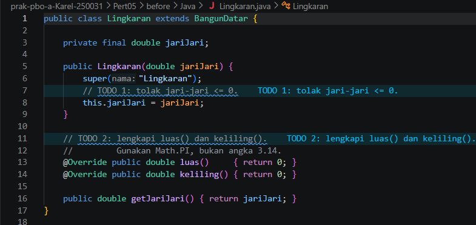

**`Persegi.java`**

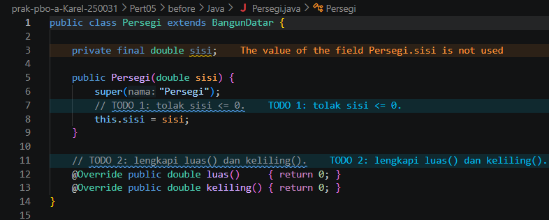

**`Main.java`**

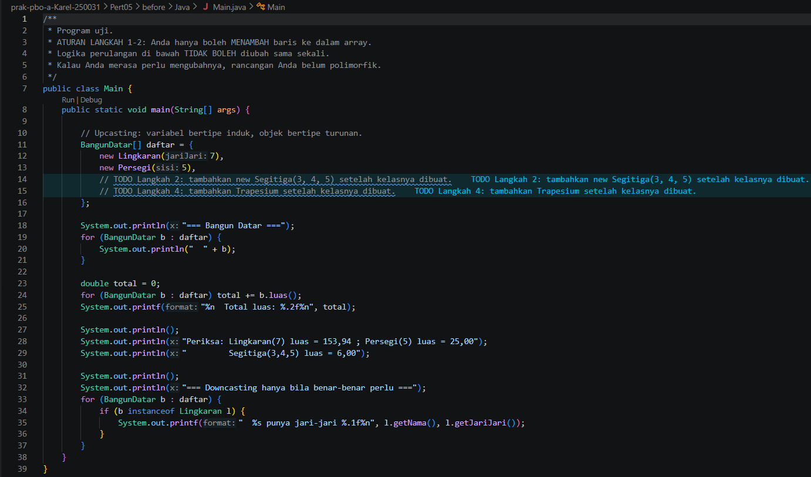

**`BangunDatar.php`**

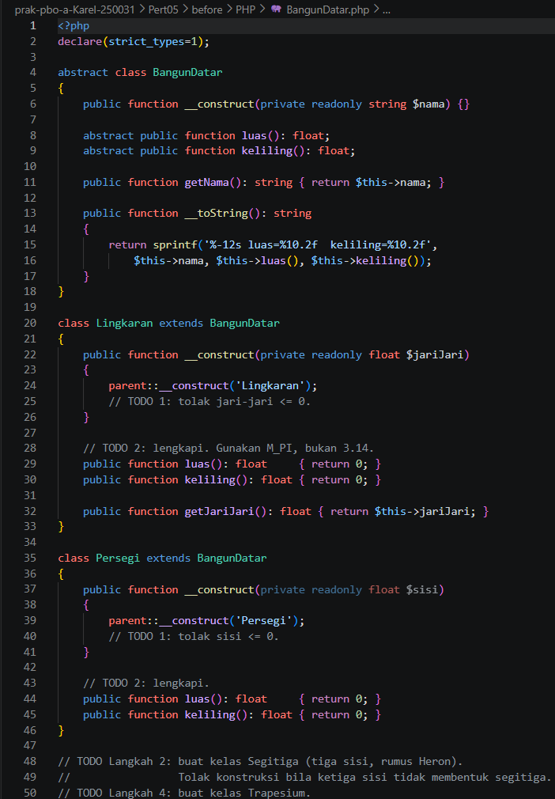

**`main.php`**

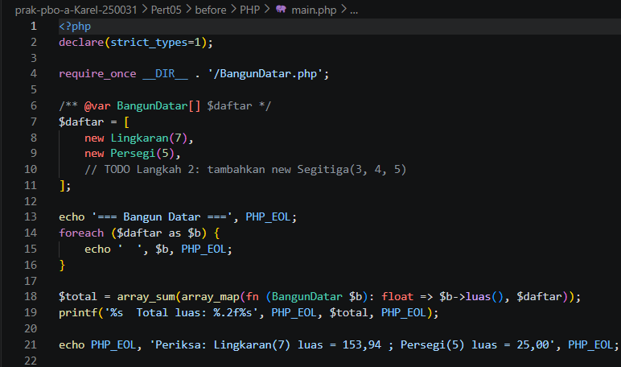

**`notifikasi.php`**

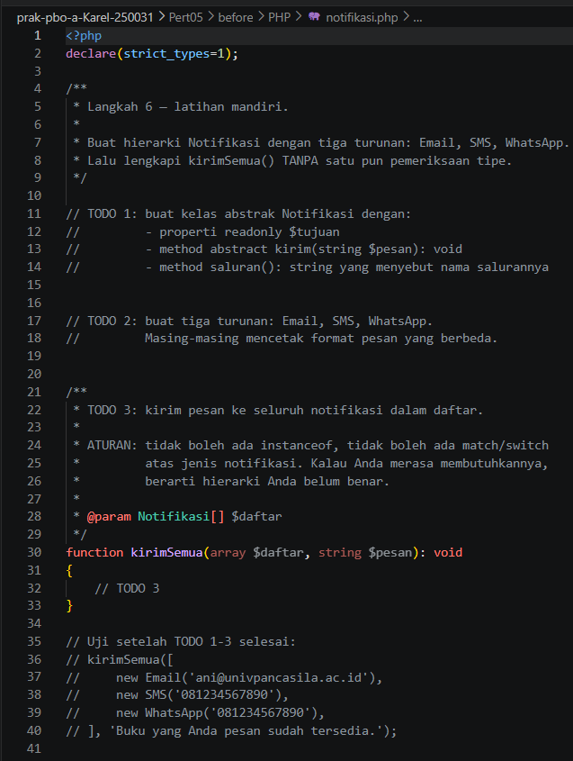

### After

**`Lingkaran.java`**

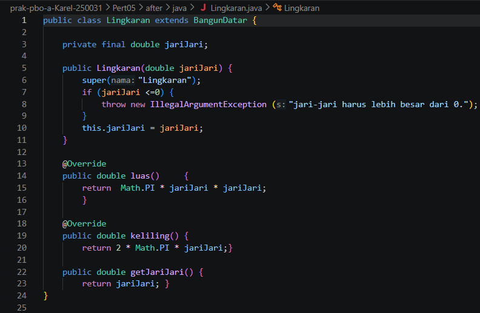

**`Segitiga.java`**

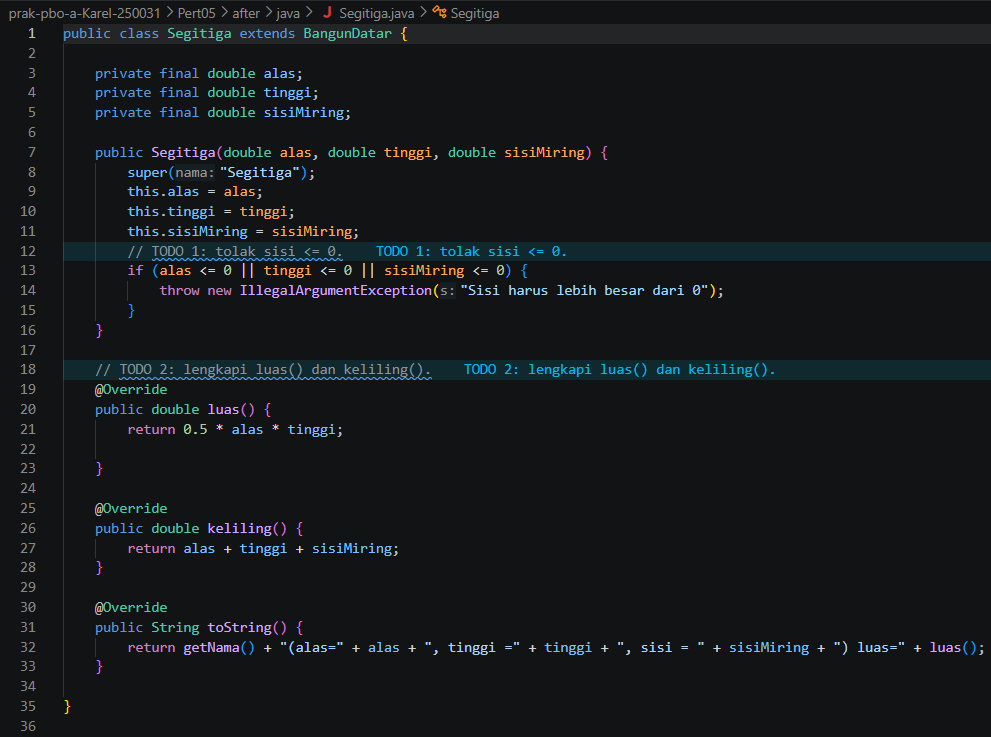

**`Trapesium.java`**

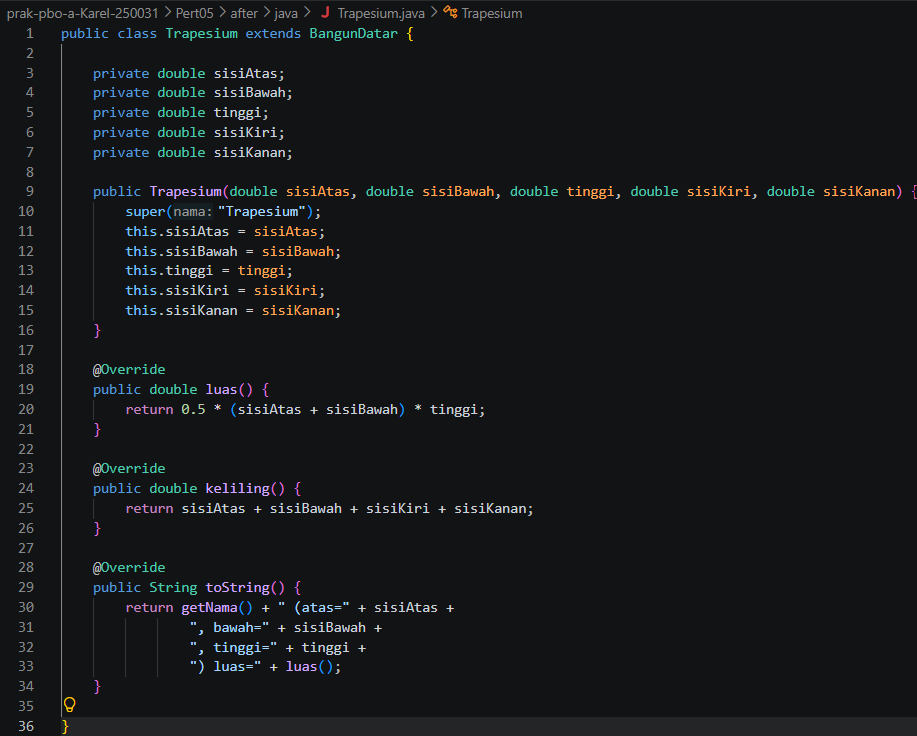

**`Main.java`**

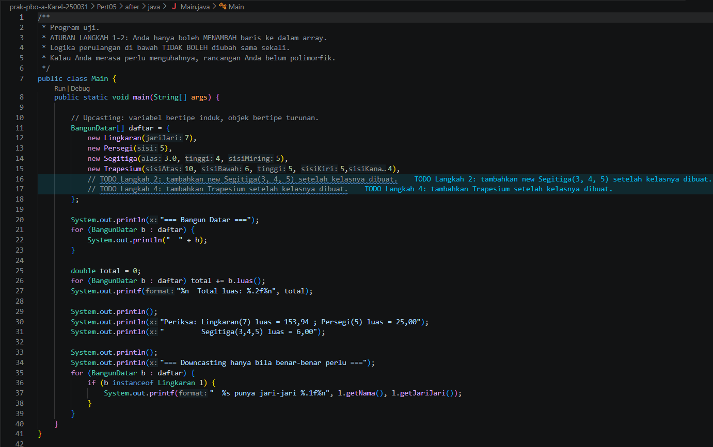

**`BangunDatar.php` (bagian 1)**

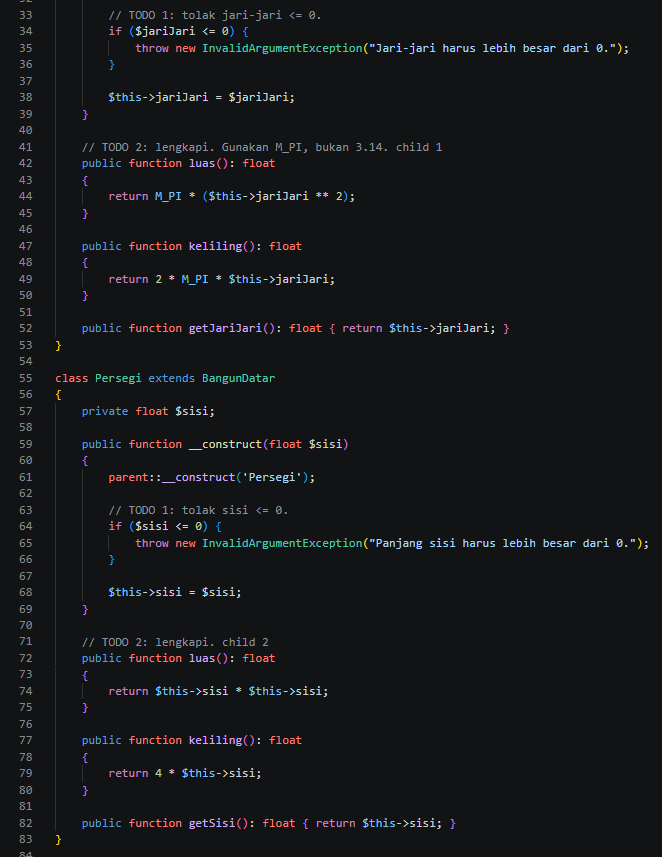

**`BangunDatar.php` (bagian 2)**

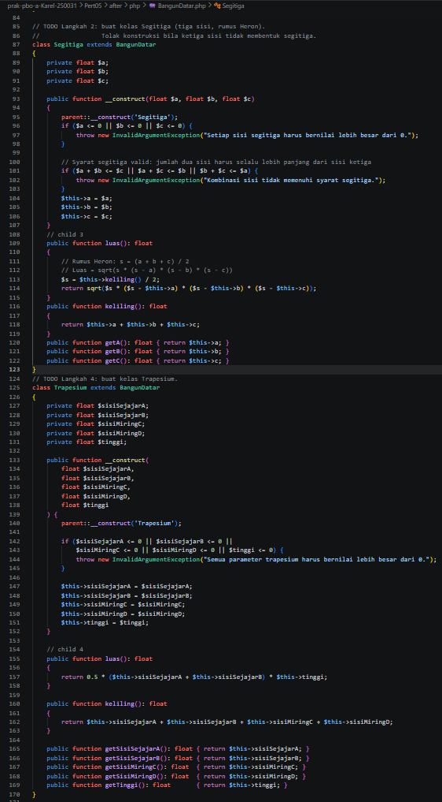

**`main.php`**

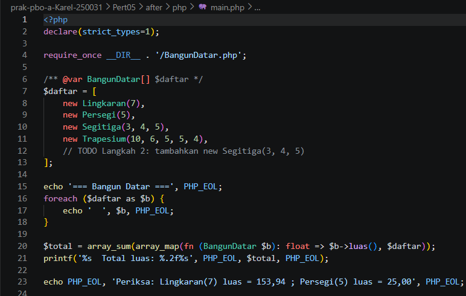

**`notifikasi.php`**

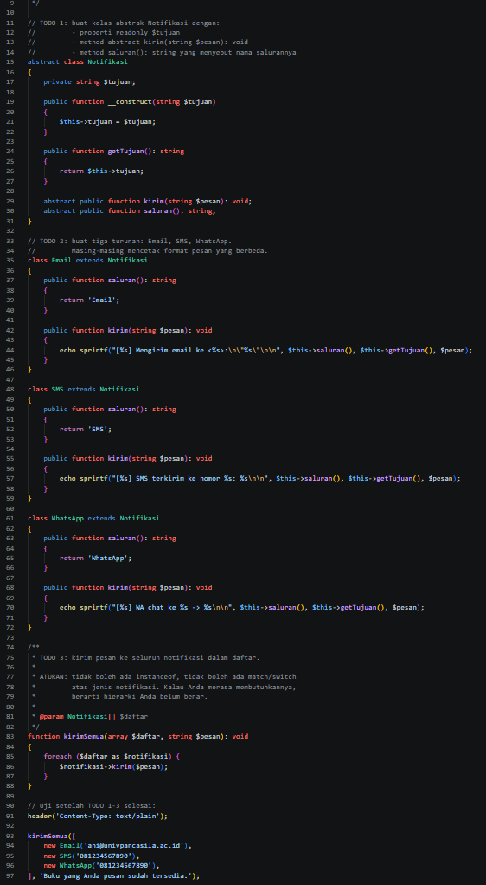

## Catatan

Hal-hal yang perlu diperhatikan pada hasil akhir:

- **`AntiPatternRefaktor.java`:** `PersegiData.luas()` memakai `Math.PI * sisi * sisi`, padahal luas persegi `sisi * sisi`. Karena itu total luas versi refaktor (238,48) berbeda dari versi anti-pattern (184,94). Kalau rumusnya diperbaiki, keduanya sama-sama 184,94.
- **Hasil `Trapesium` berbeda antara Java dan PHP** untuk angka yang sama (`10, 6, 5, 5, 4`), karena urutan parameternya berbeda. Java: atas, bawah, tinggi, kiri, kanan (tinggi = 5, luas 40). PHP: sejajar A, sejajar B, miring C, miring D, tinggi (tinggi = 4, luas 32).
- **`Segitiga` berbeda pendekatan.** Java menerima alas, tinggi, dan sisi miring. PHP menerima tiga sisi dan memakai rumus Heron. Untuk 3-4-5 keduanya menghasilkan luas 6.
- **Kode uji di `BangunDatar.php`** (bagian "Driver Code") ikut jalan saat `main.php` memanggil `require_once`, sehingga daftar bangun tercetak dua kali dengan `Persegi(4)` di bagian pertama dan `Persegi(5)` di bagian kedua. Kalau kode uji itu dihapus, hanya keluaran `main.php` yang tampil.

## Kesimpulan

Dengan polimorfisme, perulangan di `Main` tidak perlu tahu bentuk apa yang sedang dihitung, dan menambah bangun baru (`Segitiga`, `Trapesium`) cukup dengan membuat kelas turunan baru dan menambahkannya ke array tanpa mengubah logika perulangan. Perbandingan `AntiPattern` dengan `AntiPatternRefaktor` menunjukkan keuntungannya: pengetahuan cara menghitung luas ada di tiap kelas, bukan terkumpul di satu method `if / else if` yang harus disunting setiap ada tipe baru.
