# Pertemuan 06 — Abstract Class, Interface, Enum, dan Trait

| | |
|---|---|
| **Nama** | Karel Abimanyu Ahpandi |
| **NIM** | 4525210031 |
| **Kelas** | A |
| **Mata kuliah** | Praktikum Pemrograman Berorientasi Objek (PBO) |
| **Bahasa** | Java dan PHP |


## Struktur folder

```
Pert06/
├── before/            # kode awal dari dosen (masih ada TODO)
│   ├── java/          # Movable, Fuelable, TipeBahanBakar, Kendaraan, Mobil, Main
│   └── php/           # abstraksi.php (semua struktur), main.php
├── after/             # kode setelah dikerjakan
│   ├── java/          # + Sepeda.java
│   └── php/           # abstraksi.php, main.php
├── img/
│   ├── before/        # screenshot kode sebelum
│   └── after/         # screenshot kode sesudah
└── README.md
```

## Yang dikerjakan (before → after)

### Java

| Berkas | Before | After |
|---|---|---|
| `Movable.java` | `ringkasanGerak()` masih berisi teks "TODO belum dikerjakan" | Default method yang memakai `kecepatanMaksimum()` untuk membuat ringkasan |
| `Fuelable.java` | Interface kontrak pengisian bahan bakar | Tidak diubah |
| `TipeBahanBakar.java` | Hanya `BENSIN` dan `SOLAR` dengan harga 0, `LISTRIK` belum ada | Ditambah `LISTRIK`, semua punya harga. `biayaPengisian()` = jumlah x harga, `ramahLingkungan()` hanya `true` untuk `LISTRIK` (`this == LISTRIK`) |
| `Kendaraan.java` | `umur()` masih `return 0` | `Math.max(0, tahunSekarang - tahun)` supaya tidak negatif |
| `Mobil.java` | `extends Kendaraan implements Movable, Fuelable` dengan banyak TODO | `bergerak()` mencetak pesan, `kecepatanMaksimum()` = 180, `isiBahanBakar()` menolak jumlah <= 0 dan pengisian yang melebihi kapasitas |
| `Sepeda.java` | Belum ada | Baru. `extends Kendaraan implements Movable` (tanpa `Fuelable`), 2 roda, kecepatan maksimum 30 |
| `Main.java` | `Movable` yang diproses hanya `mobil` | `sepeda` ditambahkan ke daftar `Movable`. Baris `isiPenuh(sepeda)` tetap dikomentari karena memang tidak boleh dikompilasi |

### PHP

Seluruh struktur ada di `abstraksi.php`.

| Bagian | Before | After |
|---|---|---|
| `enum TipeBahanBakar` | Hanya `Bensin` dan `Solar` | Ditambah `Listrik`. Dilengkapi `label()`, `hargaPerSatuan()`, `biayaPengisian()` (dengan `match`), dan `ramahLingkungan()` |
| `trait Loggable` | Badan method `log()` masih TODO | Mencetak `[jam] NamaKelas: pesan` memakai `date('H:i:s')` dan `static::class` |
| `Kendaraan::umur()` | `return 0` | Sudah diisi, tetapi ada kesalahan penulisan (lihat Catatan) |
| `Mobil` | Sudah `implements Movable, Fuelable` dan memakai trait `Loggable`, tetapi `bergerak()`, `kecepatanMaksimum()`, dan `isiBahanBakar()` masih kosong | Ketiganya diisi: pesan bergerak, kecepatan maksimum 180, dan `isiBahanBakar()` yang memvalidasi jumlah lalu menambah `isiTangki` |
| `Sepeda` | Belum ada | Baru. Implements `Movable` saja |
| `Pesanan` | Belum ada | Baru. Kelas yang tidak sekerabat dengan `Kendaraan` tetapi memakai `Loggable` |
| `main.php` | Hanya `$mobil` | Ditambah `$sepeda` dan pemanggilan `(new Pesanan())->log(...)` |

## Screenshot

### Before

**`Movable.java`**

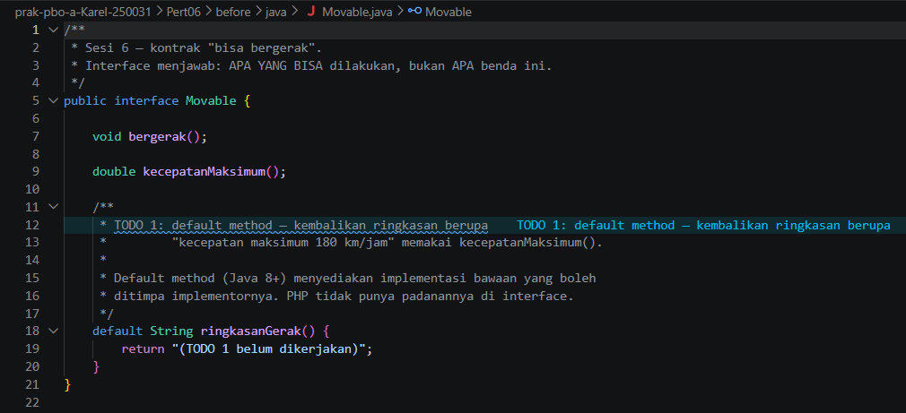

**`TipeBahanBakar.java`**

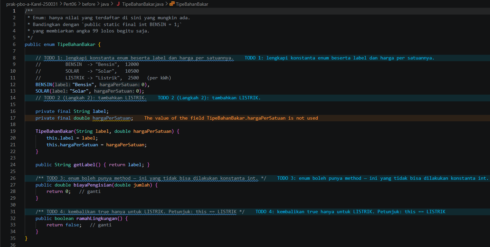

**`Kendaraan.java`**

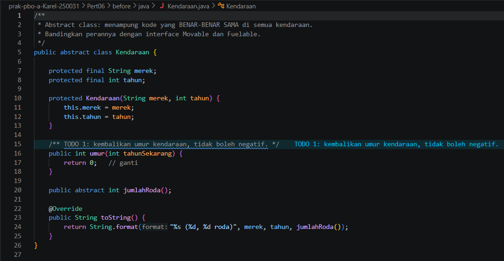

**`Mobil.java`**

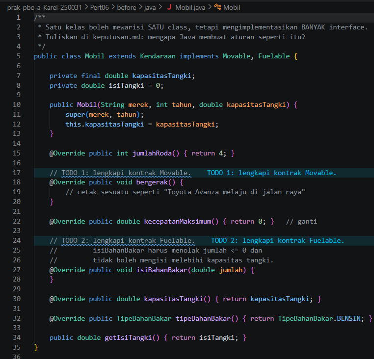

**`Main.java`**

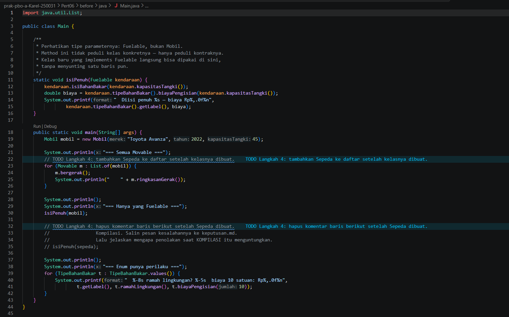

**`abstraksi.php` (bagian 1)**

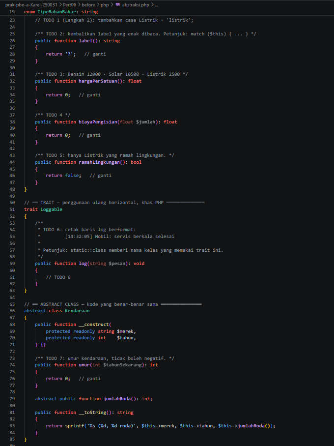

**`abstraksi.php` (bagian 2)**

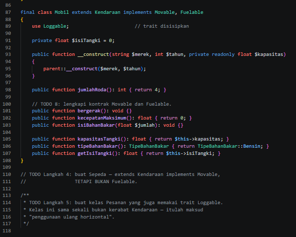

### After

**`Movable.java`**

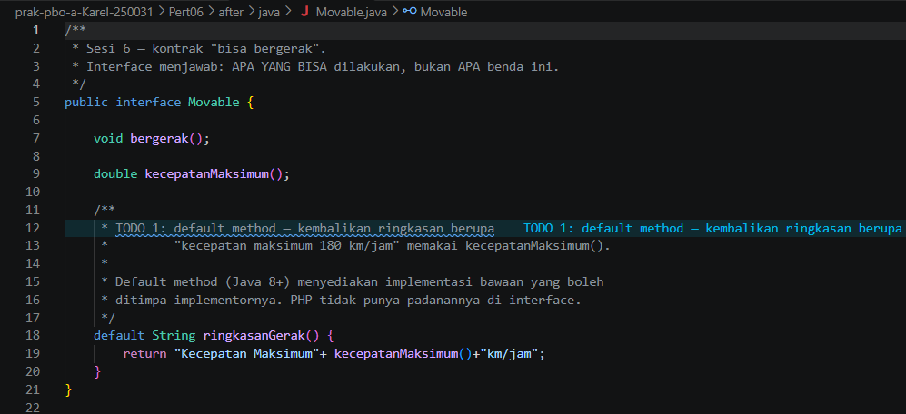

**`TipeBahanBakar.java`**

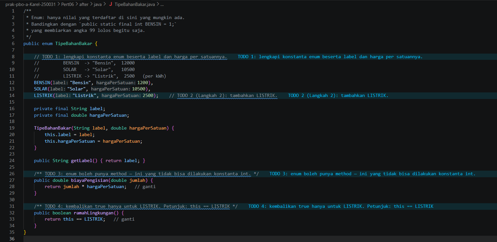

**`Kendaraan.java`**

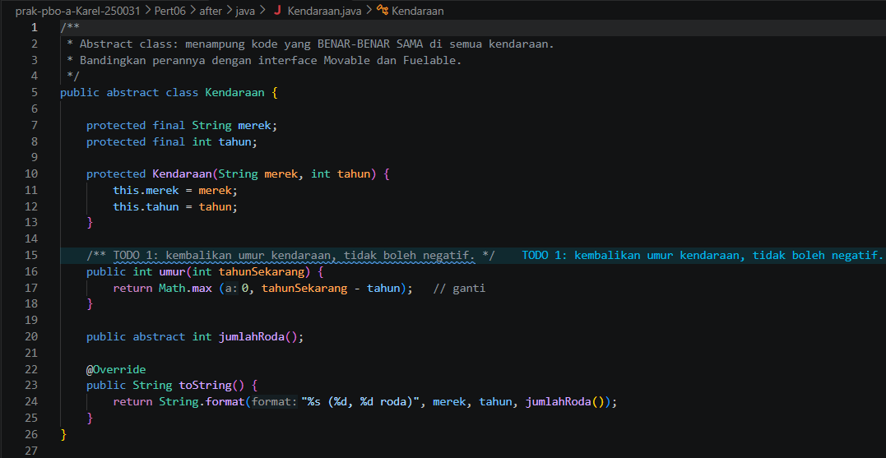

**`Mobil.java`**

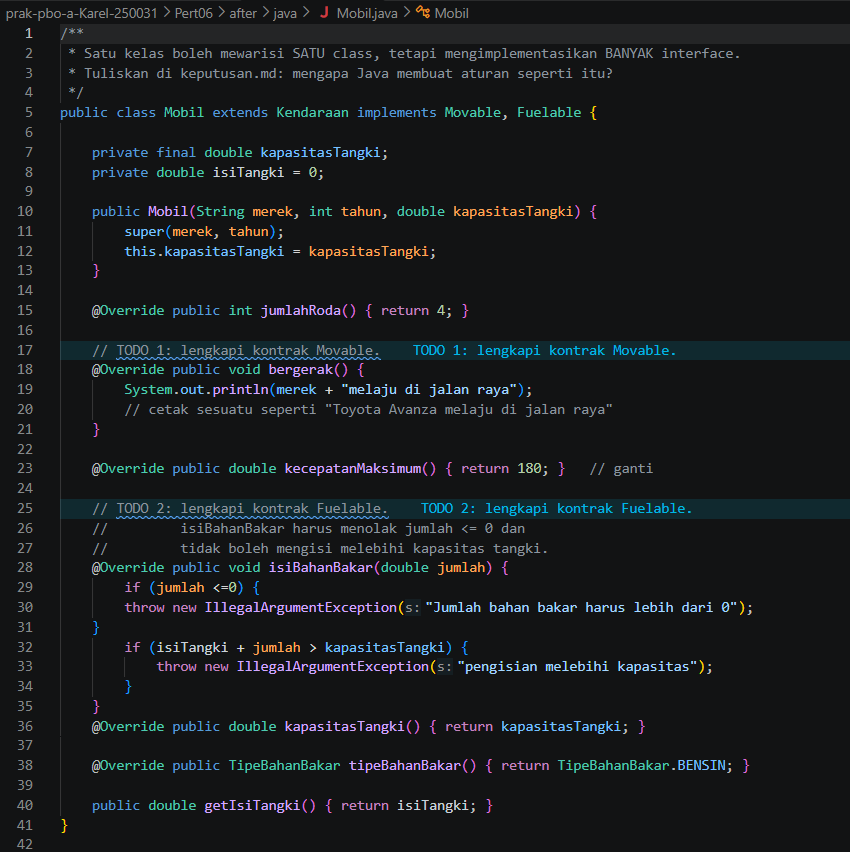

**`Sepeda.java`**

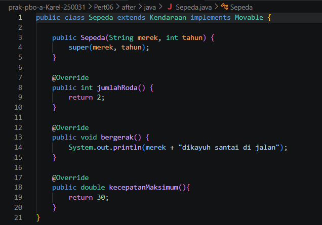

**`Main.java`**

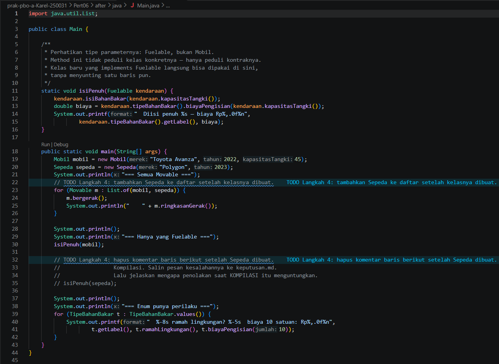

**`abstraksi.php` (bagian 1)**

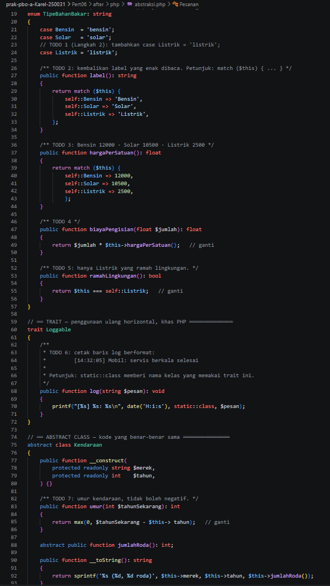

**`abstraksi.php` (bagian 2)**

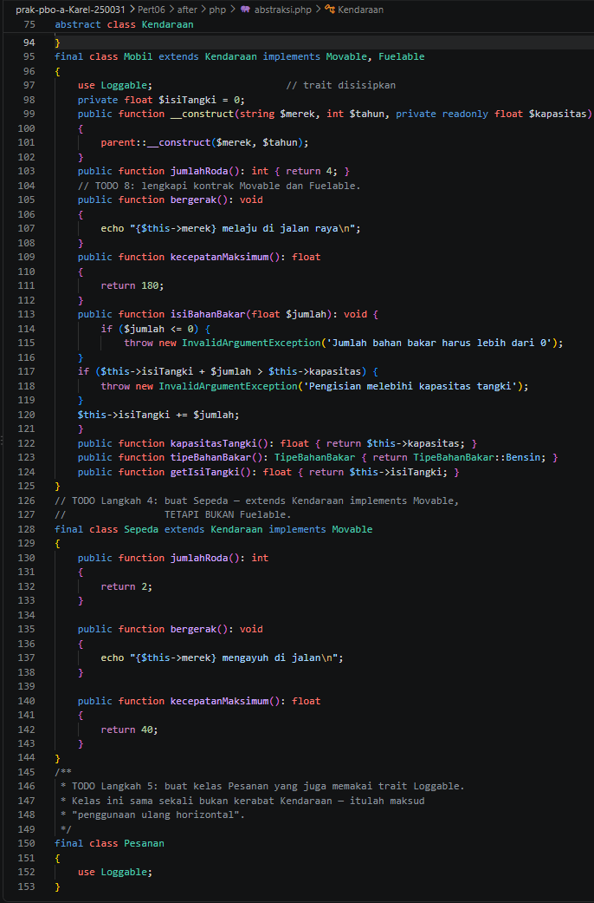

**`main.php`**

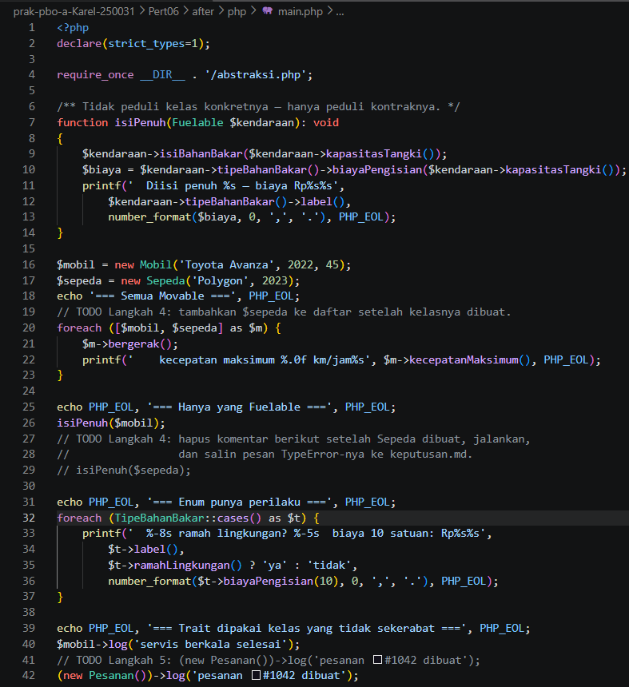


## Kesimpulan

Pembagian peran jadi lebih jelas: abstract class (`Kendaraan`) untuk kode yang sama, interface (`Movable`, `Fuelable`) untuk kemampuan, enum (`TipeBahanBakar`) untuk pilihan tetap yang punya perilaku, dan trait (`Loggable`) untuk berbagi kode antar kelas yang tidak sekerabat. Karena `Movable` dan `Fuelable` dipisah, `Sepeda` tidak dipaksa punya bahan bakar, dan kesalahan memberikannya ke `isiPenuh()` langsung ketahuan oleh kompilator atau `TypeError`, bukan saat program sudah berjalan.
